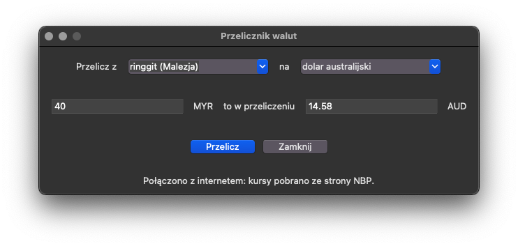
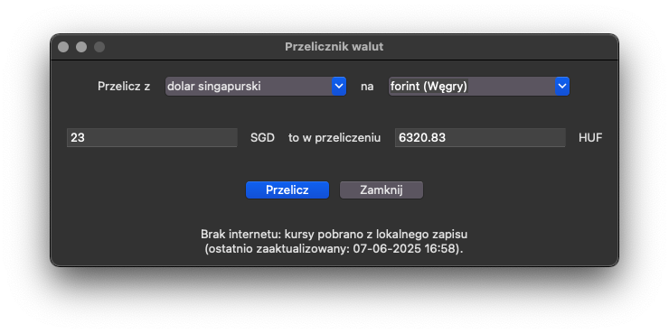

# Tkinter Currency Converter


## Table of contents
* [General info](#general-info)
* [Demonstration](#demonstration)
* [Setup](#setup)

## General info
a GUI-based currency converter that retrieves data from the National Bank of Poland.

## Demonstration
The interface is simple and intuitive:
* Select the source and target currencies;
* Enter the amount you want to convert;
* hit "Przelicz" ("Convert").

<p style="text-align: center;">
  
</p>
If there is no internet connection, the app will use the most recently saved exchange rates.
<p style="text-align: center;">
  
</p>

## Setup
To run the program, follow these steps:

1. **Clone the repository:**
    ```
    git clone https://github.com/nik5677/tkinter-currency-converter.git
    cd tkinter-currency-converter
    ```
2. **Create and activate a virtual environment:**
    ```
    python3 -m venv venv
    source venv/bin/activate
    ```
   *on Windows:*
   ```
    python3 -m venv venv
    venv/Scripts/activate
    ```
3. **Install the required libraries:**
    ```
    pip install -r requirements.txt
    ```
4. **Run the program:**
    ```
    python3 main.py
    ```